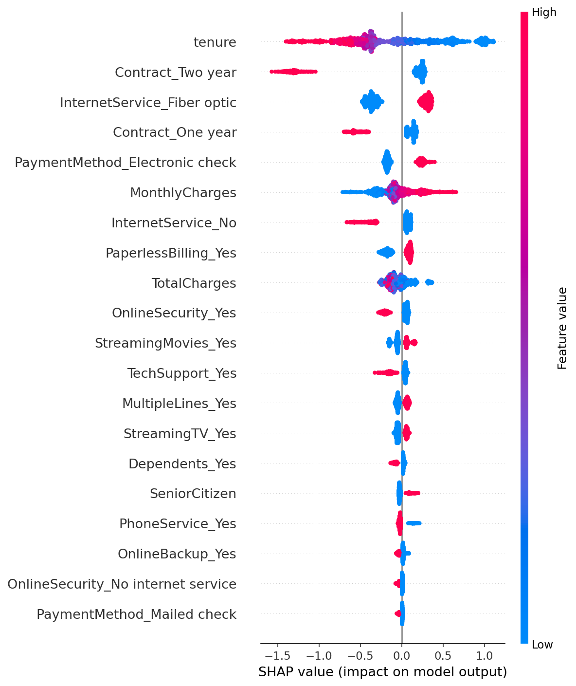
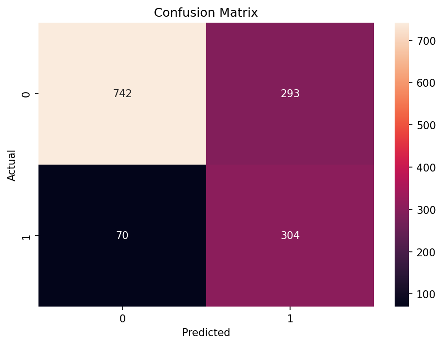

# 📉 Customer Churn Prediction with Explainable AI (XGBoost + SHAP)

**Author:** Alexus Glass  
**Goal:** Build a fully production-style **Computational Data Science project** that predicts telecom customer churn, explains predictions using **SHAP**, and deploys an **interactive Streamlit app**.  

This project demonstrates:
- ✅ **Data preprocessing and cleaning**
- ✅ **Class imbalance handling**
- ✅ **Hyperparameter optimization with Optuna**
- ✅ **Explainable AI via SHAP**
- ✅ **Modular, production-ready code organization**
- ✅ **Interactive deployment for real-time predictions**

---

## 📂 Repository Structure

```
customer-churn-prediction/
│
├── app/                  # Streamlit web application
│   └── streamlit_app.py
├── artifacts/            # Saved trained model + feature list + tuning logs
│   ├── model_xgb.pkl
│   ├── feature_list.json
│   ├── optuna_best_params.json
│   └── optuna_trials.csv
├── data/                 # Dataset (Telco Customer Churn CSV)
│   └── WA_Fn-UseC_-Telco-Customer-Churn.csv
├── notebooks/
│   └── churn_model.ipynb # Main analysis + training notebook
├── shap_outputs/         # SHAP plots (summary, dependence, interactions)
├── src/
│   ├── preprocessing.py  # Data cleaning + one-hot encoding
│   ├── model.py          # Training, evaluation, SHAP utilities
│   └── tune.py           # Optuna hyperparameter search
├── requirements.txt      # Dependencies
└── README.md             # This file
```

---

## 📊 Dataset

- **Source:** IBM Telco Customer Churn Dataset  
- **Rows:** ~7,000 customers  
- **Features:** 20+ columns (demographics, services, contract, billing, tenure, charges)  
- **Target Variable:** `Churn` (binary: Yes/No)

---

## 🛠️ Tech Stack

- **Python 3.11**
- **Core Libraries:** pandas, numpy, scikit-learn, xgboost, shap, optuna, matplotlib, seaborn
- **Deployment:** Streamlit
- **Environment:** `.venv` isolated virtual environment

---

## 🔬 Workflow Overview

1️⃣ **Data Preprocessing**  
- Handle missing values (`TotalCharges`)  
- Encode target variable (Yes → 1, No → 0)  
- One-hot encode categorical features  

2️⃣ **Class Imbalance Handling**  
- Compute `scale_pos_weight = (#neg / #pos)` for XGBoost  
- Ensures minority churn cases are not overlooked  

3️⃣ **Hyperparameter Tuning (Optuna)**  
- 5-fold stratified cross-validation maximizing **ROC AUC**  
- Search space includes:
  - `n_estimators`, `max_depth`, `learning_rate`
  - `subsample`, `colsample_bytree`, `reg_lambda`
  - `min_child_weight`, `gamma`

4️⃣ **Model Training & Evaluation**  
- Train tuned XGBoost classifier
- Metrics (replace with your results):
  - **ROC AUC:** `<value>`
  - **Accuracy:** `<value>`
  - **Recall (Churn class):** `<value>`
- Confusion matrix plotted for error analysis

5️⃣ **Explainable AI (SHAP)**  
- Global SHAP summary plot for overall feature importance
- Dependence plots showing how churn risk changes with feature values
- Interaction plots showing feature interactions

6️⃣ **Artifacts Exported**  
- `model_xgb.pkl` (trained model)
- `feature_list.json` (aligned features)
- Optional Optuna logs for reproducibility

7️⃣ **Streamlit App**  
- Batch CSV predictions
- Single-customer prediction via form
- Local SHAP explanation for individual cases

---

## 📸 Key Visuals

### SHAP Summary Plot


### Confusion Matrix


*(Additional dependence and interaction plots available in `/shap_outputs/`)*

---

## 🖥️ Demo App

Run locally to test the trained model:

```bash
python -m streamlit run app/streamlit_app.py
```

- **Batch mode:** Upload a CSV and download predictions with churn probabilities
- **Single example mode:** Adjust input parameters and see predicted churn risk
- **Explainability:** View top SHAP contributions for each prediction

---

## 📦 Installation & Setup

```bash
# Clone repository
git clone https://github.com/<YOUR_USERNAME>/customer-churn-prediction.git
cd customer-churn-prediction

# Create virtual environment
python -m venv .venv
.\.venv\Scripts\Activate.ps1      # Windows
# or
source .venv/bin/activate         # macOS/Linux

# Install dependencies
pip install -r requirements.txt

# Start Jupyter Notebook
jupyter notebook notebooks/churn_model.ipynb
```

---

## 🧠 Key Learnings

- Handling **class imbalance** significantly improved churner recall
- **Optuna tuning** boosted ROC AUC by optimizing key hyperparameters
- **SHAP interpretability** revealed actionable churn drivers for business strategy
- Full **end-to-end packaging** demonstrates how data science models transition from research → deployment

---

## 🔮 Future Enhancements

- Deploy app to **Streamlit Cloud** or Docker container
- Add **survival analysis** to predict *time-to-churn*
- Include **threshold tuning** to further improve recall
- Experiment with **LightGBM** and **AutoML pipelines**

---

## 📬 Contact

👩🏽‍💻 **Alexus Glass**  
📧 lexusimnitech@gmail.com 
🔗 [GitHub Profile](https://github.com/lexusimni)
